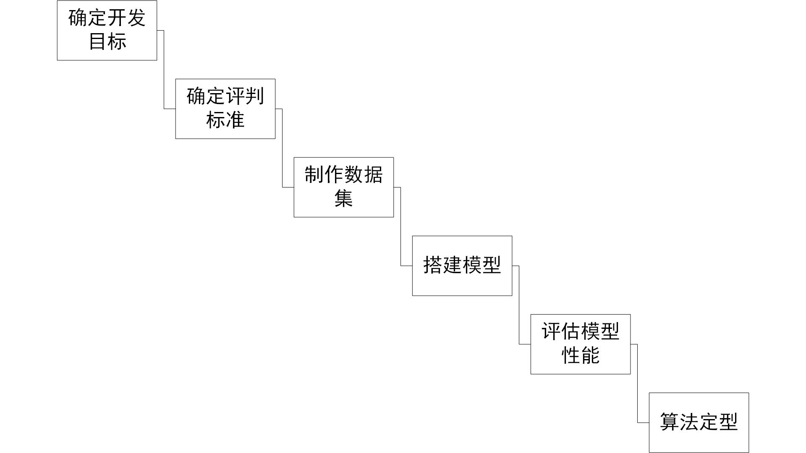

# algorithm_develop
---
## 1-说明
本项目主要用于进行算法的流程规范的确定以及各种算法测试结果的统计。 

## 2-算法开发流程

## 3-常用算法说明
在VOC数据集的评价测试上选取了基于全数据集测试的算法评估数据来进行说明，网址是[http://host.robots.ox.ac.uk:8080/leaderboard/main_bootstrap.php](http://host.robots.ox.ac.uk:8080/leaderboard/main_bootstrap.php "PASCAL VOC Challenge performance evaluation")。  
### 3-1 常用算法效果

### 3-2 常用算法说明

## 4-算法测试结果统计
### 4-1 YOLOv3
模型介绍:

    1、yolov3模型通过将原始图片进行一系列的卷积、激活等过程，最终可直接回归生成出多个锚点以预测出目标位置和大小。
    
模型性能：

    1、yolov3模型在coco数据集上，mAP可达到 60.6。
    2、算法运算速度在40ms以内。
### 4-2 SSD
模型介绍:  
模型性能： 
### 43-3 faster-RCNN
模型介绍:  
模型性能：
### 4-4 GAN
模型介绍:  
模型性能：